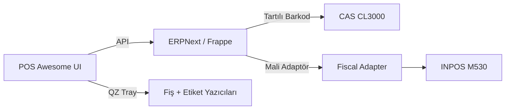

# CK Kuruyemiş POS (ERPNext + POS Awesome)

Kuruyemiş mağazaları için OSS‑first POS yığını: ERPNext + POS Awesome + QZ Tray. Amaç: TeraziPOS/Viapos'tan hızlı, esnek ve sahaya uygun bir kurulum.

## 5 Dakikalık Hızlı Başlangıç
Aşağıdaki adımlar Windows içindir. Her adımın sonunda beklenen sonuç belirtilir.

1) Önkoşulları kontrol et
```powershell
.\scripts\windows\00-onkosul-kontrol.ps1
```
Beklenen sonuç: Tüm kritik kontroller **OK**.

2) Altyapıyı hazırla (frappe_docker pin)
```powershell
.\scripts\windows\01-bootstrap.ps1
```
Beklenen sonuç: `frappe_docker` indirildi, pinli commit'e geçildi, `qz-tray.js` hazır.

3) Servisleri başlat
```powershell
.\scripts\windows\02-baslat.ps1 -OpsiyonelServisler
```
Beklenen sonuç: Docker container'ları ayakta.

4) Site oluştur
```powershell
.\scripts\windows\03-site-olustur.ps1 -SiteAdi kuruyemis.local -YoneticiSifresi admin -MariaDBRootSifresi admin
```
Beklenen sonuç: Site oluşturuldu.

5) Uygulamaları kur
```powershell
.\scripts\windows\04-uygulamalari-kur.ps1 -SiteAdi kuruyemis.local
```
Beklenen sonuç: ERPNext + POS Awesome + CK Kuruyemiş POS yüklendi ve TR varsayılanlar uygulandı.

6) Sağlık ve duman testi
```powershell
.\scripts\windows\05-doctor.ps1 -SiteAdi kuruyemis.local
DRY_RUN=0 .\scripts\windows\09-smoke-test.ps1 -SiteAdi kuruyemis.local
```
Beklenen sonuç: Barkod presetleri ve test baskıları başarılı.

## Desteklenen Donanım
- INPOS M530 (ÖKC) – MVP: manuel mali fiş
- CAS CL3000 – tartılı barkod
- CAS ER‑JR – (plan)
- X‑Printer 490B – 38x80 raf etiketi
- ZY907 – mali olmayan fiş
- Barkod okuyucu (USB HID)

## Bugün Dükkânda Çalıştır – Demo Kontrol Listesi
- Tartılı barkod tarat: ürün sepete otomatik düşsün
- QZ Tray ile **mali olmayan fiş** bas
- QZ Tray ile **raf etiketi (38x80)** bas

## Mimari Şema (Özet)


## Tamamlanma Tanımı
- `05-doctor.ps1` **OK** döner
- `09-smoke-test.ps1` barkod + test fiş + test etiketini doğrular
- `docs/08-acilis-checklist.md` kutucukları tamamlanır

## Dokümantasyon
Başlangıç noktası: `docs/00-hizli-baslangic.md`

## Lisans
Çekirdek bileşenler GPLv3. Ayrıntılar için `THIRD_PARTY_NOTICES.md`.
