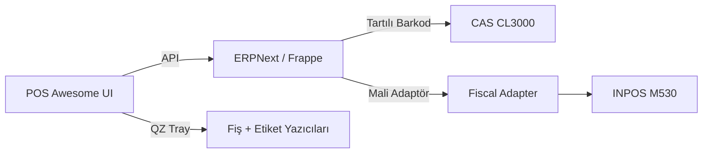

# CK Kuruyemiş POS (ERPNext + POS Awesome + QZ Tray)

Kuruyemiş mağazaları için OSS‑first POS yığını: ERPNext + POS Awesome + QZ Tray. Amaç: TeraziPOS/Viapos'tan hızlı, esnek ve sahaya uygun bir kurulum.

## 5 Dakikalık Hızlı Başlangıç
Aşağıdaki adımlar Windows içindir. Her adımın sonunda beklenen sonuç belirtilir.

1) Tek komut kurulum (önerilen)
```powershell
.\scripts\windows\kur.ps1
```
Beklenen sonuç: Kurulum tamamlanır, doktor + duman testi çalışır.

Demo verisi yüklemek için:
```powershell
.\scripts\windows\kur.ps1 -DemoVeriYukle
```

2) Adım adım kurulum (isteğe bağlı)
```powershell
.\scripts\windows\00-onkosul-kontrol.ps1
.\scripts\windows\01-bootstrap.ps1
.\scripts\windows\02-baslat.ps1 -OpsiyonelServisler
.\scripts\windows\03-site-olustur.ps1 -SiteAdi kuruyemis.local -YoneticiSifresi admin
.\scripts\windows\04-uygulamalari-kur.ps1 -SiteAdi kuruyemis.local
```
Beklenen sonuç: ERPNext + POS Awesome + CK Kuruyemiş POS yüklendi, migrate tamamlandı ve TR varsayılanlar uygulandı.

Opsiyonel modül örneği (QR/WhatsApp/WHB):
```powershell
.\scripts\windows\04-uygulamalari-kur.ps1 -SiteAdi kuruyemis.local -OpsiyonelModuller scan_me,whb
```

3) Yazıcıları tanıt ve test et
- `http://kuruyemis.local:8080/app/pos_printer_setup`
- POS Awesome menüsü:
  - “Bilgi Fişi Yazdır (Mali Değil)”
  - “Raf Etiketi Yazdır (38x80)”
Beklenen sonuç: QZ Tray üzerinden test baskıları alınır.

## Desteklenen Donanım
- INPOS M530 (ÖKC) - MVP: manuel mali fiş
- CAS CL3000 - tartılı barkod
- CAS ER-JR - (plan)
- X-Printer 490B - 38x80 raf etiketi
- ZY907 - mali olmayan fiş
- Barkod okuyucu (USB HID)

## Bugün Dükkânda Çalıştır - Demo Kontrol Listesi
- Tartılı barkod tarat: ürün sepete otomatik düşsün
- QZ Tray ile **bilgi fişi** bas
- QZ Tray ile **raf etiketi (38x80)** bas

## Mimari Şema (Özet)


## Definition of Done
- `05-doctor.ps1` **OK** döner
- `09-smoke-test.ps1` barkod + test fiş + test etiketi doğrular
- `docs/08-acilis-checklist.md` kutucukları tamamlanır

## Sık Sorulan Sorular
**Q: QZ Tray uyarısı görünüyor, sorun mu?**  
**A:** Geliştirme ortamında uyarı normaldir. Üretimde imzalı istek gerekir (`docs/03-yazdirma-qz.md`).

**Q: Site açılmıyor (`http://kuruyemis.local:8080`)?**  
**A:** `.\scripts\windows\05-doctor.ps1` çalıştırın ve servis durumunu kontrol edin.

**Q: POS Awesome güncellemeleri görünmüyor?**  
**A:** Tarayıcı site verilerini temizleyin ve sayfayı yenileyin (`docs/07-sorun-giderme.md`).

**Q: Tartılı barkod sepete düşmüyor?**  
**A:** Üründe `scale_plu` alanını doldurun ve kuralın etkin olduğundan emin olun.

**Q: Demo verisi nasıl yüklenir?**  
**A:** `.\scripts\windows\04-uygulamalari-kur.ps1 -SiteAdi kuruyemis.local -DemoVeriYukle` çalıştırın.

## Lisans Raporu
Lisans raporu üretimi (Windows):
```powershell
.\scripts\windows\10-lisans-raporu.ps1
```
Raporlar: `docs/lisans-raporlari/`

## Dokümantasyon
Başlangıç noktası: `docs/00-hizli-baslangic.md`

## Lisans
Çekirdek bileşenler GPLv3. Ayrıntılar için `THIRD_PARTY_NOTICES.md`.
